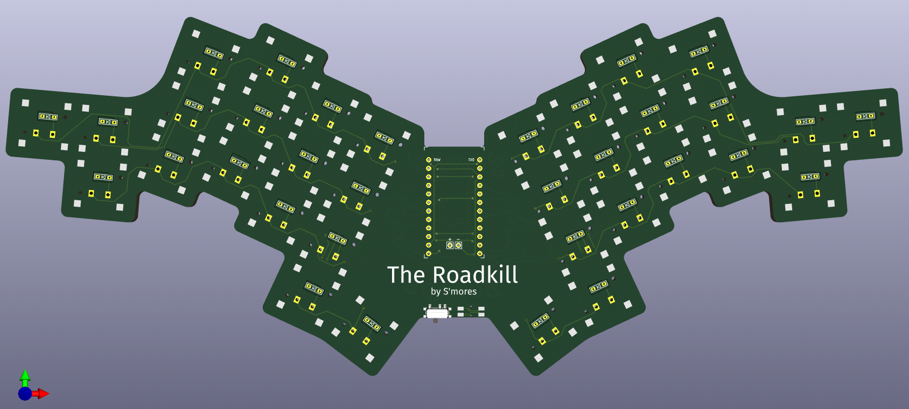

The Roadkill
=============

The Roadkill is a compact version of the [Osprette][osprette], using the new PG1316S butterfly switches from Kailh. The keyboard is a 34-key unibody that runs on any pro-micro compatible daughterboard. It comes with bluetooth support by way of battery terminals and a power switch.

# Ordering One

To order one of these from JLC, just upload the `roadkill.zip` archive to the Order Now page at <https://jlcpcb.com>. Removing the order number is always recommended.

# Pictures

_More to come when PCB's arrive!_

[osprette]: https://github.com/smores56/osprette
